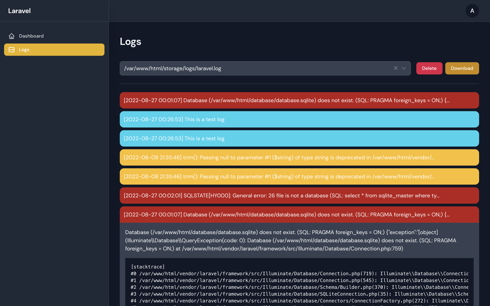

# Filament Log Manager

[](https://packagist.org/packages/drkmode/filament-log-manager)
[](https://packagist.org/packages/drkmode/filament-log-manager)

This package allows you to view the Laravel application logs in a simple and clear way. Additional functionalities include the ability to download and delete log files.



## Filament Admin Panel

This package is tailored for [Filament Admin Panel](https://filamentphp.com/).

Make sure you have installed the admin panel before you continue with the installation. You can check the [documentation here](https://filamentphp.com/docs/admin)

## Installation

You can install the package via composer:

```bash
composer require drkmode/filament-log-manager
```

You can publish the config file with:

```bash
php artisan vendor:publish --tag="filament-log-manager-config"
```

You can publish translations files with:

```bash
php artisan vendor:publish --tag="filament-log-manager-translations"
```

## Usage

Once installed, the package is ready to use. You will be able to see it in your Filament admin panel.

## Testing

```bash
composer test
```

## License

The MIT License (MIT). Please see [License File](LICENSE.md) for more information.
